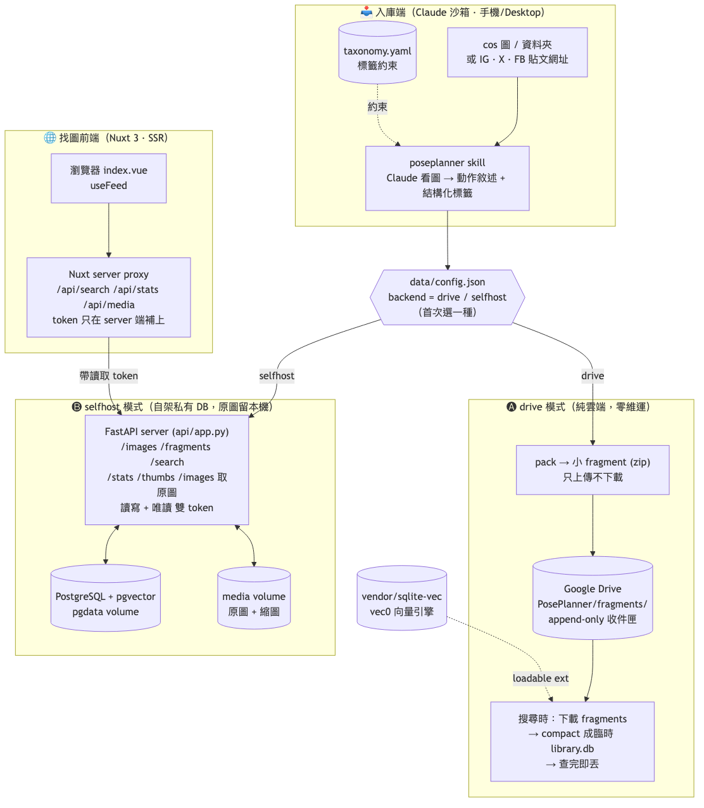

# PosePlanner

**Cosplay 拍攝計劃書生成小幫手** —— 一個由獨立開發者NormanHsiao開發的**自動學習、持續延展**的個人 cos 攝影參考庫。

每天餵入你覺得漂亮的 cosplay 圖，它會自動辨識角色／作品、轉成動作敘述與結構化標籤入庫，逐漸學會你的審美與出鏡偏好，在你需要參考圖或是靈感時幫你挑 pose、甚至根據出角角色生成拍攝計劃書。

> ## ☁️ 重要：庫存在「你自己的地方」，兩種後端二選一
> 我們**不持有、也不經手你的任何資料**。第一次使用時選一種儲存後端（記在 `data/config.json`）：
>
> 1. **Google Drive（純雲端、預設）**：庫與圖只存在**你自己的 Google Drive**，零維運、手機可用。
>    需先在 Claude 綁定 **Google Drive 連接器**（**設定 → 連接器 → Google Drive**）。
> 2. **私有 DB（自架）**：庫存在**你網域內自架的一台機器**（PostgreSQL + 圖片接收服務，
>    `docker compose up` 即可），**原圖留在你自己手上**、無單筆大小上限。見 [server/README.md](server/README.md)。
>
> 👉 第一次執行時 skill 會問你要哪一種；也可手動設定：
> ```bash
> python3 scripts/backend.py status                          # 看目前後端
> python3 scripts/backend.py set --backend drive             # 用 Google Drive
> python3 scripts/backend.py set --backend selfhost \        # 用私有 DB
>     --base-url http://192.168.x.x:8000 --token <token>
> ```

> ## 🎓 開發初衷與使用聲明
> 本專案是為了**幫助新手攝影師與 cosplayer 學習、成長**而開發——讓你累積審美、練習構圖與 pose、找到靈感。
>
> ⚠️ **絕對不支持任何盜版或商業使用。** 請只餵入你有權使用的圖片，並尊重原作者、原 IP 與被攝者的權益；
> 本工具僅供個人學習與參考，請勿用於任何侵權或營利行為。

---

## 🏗️ 系統架構

「入庫」與「搜尋」分離，並支援兩種儲存後端（純雲端 Drive / 自架私有 DB），首次使用時二選一。



> 圖的原始檔在 [docs/architecture.mmd](docs/architecture.mmd)（Mermaid）。修改後重繪：
> ```bash
> mmdc -i docs/architecture.mmd -o docs/architecture.png -b white -w 2400
> ```

---

## 🚀 安裝

PosePlanner 是一個 **Agent Skill**。Claude Desktop 與 Claude Code 的安裝方式不同 ——
**Desktop 要上傳 zip，Code 是放進 skills 資料夾**。請依你用的版本選一邊。

> ⚠️ 注意：兩者的 skill 目錄不互通。`~/.claude/skills/` 只有 **Claude Code** 會讀，
> **Claude Desktop 不讀那裡**，必須照下面 A 的方式從設定上傳。

### A. Claude Desktop（上傳 zip）

前置：Desktop 需開啟 **程式碼執行 / Skills 能力**（付費方案）。

1. 打包出可上傳的 zip：
   ```bash
   bash scripts/build_skill_zip.sh        # 產出 dist/poseplanner-skill.zip
   ```
2. 開 **Claude Desktop → 設定（Settings）→ Capabilities / 能力 → Skills**。
3. 選 **Upload skill / 新增 skill**，上傳 `dist/poseplanner-skill.zip`，啟用它。
4. 回到對話，**把圖直接拖／上傳進輸入框**，然後說：
   > 幫我把這張 cos 圖入庫

   Claude 會看圖 → 產敘述與標籤 → 在沙箱裡寫入 `library.db`。

> 📌 Desktop 沙箱是雲端 Linux、每次對話會重置，所以 `library.db` 預設**不跨對話保存**。
> 想累積成長的庫，見下方〔跨對話保存〕。縮圖在 Desktop 由 Pillow 產（沙箱內建），
> 不依賴 macOS 的 `sips`。

#### 🔐（選配）把私有 DB 連線烤進 zip，免每次重設

用 **selfhost（私有 DB）** 後端時，雲端沙箱每次對話重置，預設每開新對話都要重跑一次
`backend.py set …`。在專案根目錄放一份 `.env`，`build_skill_zip.sh` 打包時會自動把連線
資訊寫進 zip 裡的 `data/config.json`，上傳後即為「私有 DB 已連線」狀態，不必再手動設定。

```bash
cp .env.example .env          # 複製範本
# 編輯 .env，填入你的私有 DB 連線：
#   POSEPLANNER_BACKEND=selfhost
#   POSEPLANNER_BASE_URL=http://192.168.x.x:8000
#   POSEPLANNER_TOKEN=<入庫用讀寫 token；只搜尋可填唯讀 token>
bash scripts/build_skill_zip.sh   # 看到「🔐 已從 .env 烤入連線設定」即成功
```

> 🔒 `.env`、產出的 `data/config.json` 與 `dist/*.zip` 都已被 `.gitignore` 忽略，不會進版控。
> 換 IP / token 時只改 `.env` 重新打包、重新上傳即可。
> **沒有 `.env` 也完全正常** —— 打包內容與原本一致，skill 上傳後會在對話裡問你要哪種後端。

### B. Claude Code（CLI / VSCode）

```bash
git clone <this-repo-url> PosePlanner && cd PosePlanner
mkdir -p ~/.claude/skills
ln -s "$(pwd)" ~/.claude/skills/poseplanner   # 軟連結，git pull 即更新
```
重開 Claude Code，輸入 `/` 應看到 `poseplanner`；圖放本機資料夾，直接說
「把 `~/Desktop/今天的圖/` 入庫」。庫永久存在本機 `data/library.db`。

### C. 後端服務：私有 DB（自架，選 selfhost 才需要）

> 只有要用**私有 DB 後端**（庫存在你自己網域內的機器）才需要這步；
> 用 Google Drive 模式可**完全跳過**。
> 大多數人用下面的〔🚀 一鍵全部〕即可；想把後端、前端拆到不同機器再看〔🧰 進階〕。

#### 🚀 一鍵全部（官方建議）：後端 ＋ 前端 ＋ skill

最省事的做法——在一台**乾淨的機器**（或你自己的電腦）上貼這一行，三個服務一次到位。
它會自己 clone 專案、裝 Docker、起後端，並**自動把 domain 與 token 串好**，
你完全不用手動複製貼上 token 或改 domain：

```bash
curl -fsSL https://raw.githubusercontent.com/normantaipei/PosePlanner/main/bootstrap.sh | bash
```

它會依序：

1. clone 專案 → 起**後端**（PostgreSQL + 圖片接收服務），亂數產生密碼與兩組 token。
2. 把 domain ＋**唯讀** token 帶進**前端**找圖頁容器（token 只留在 server 端、不外洩給瀏覽器）。
3. 把 domain ＋**讀寫** token 烤進 **skill** 的 `dist/poseplanner-skill.zip`（上傳即連線、免再設定）。
4. 最後印出**前端網址**與 **skill 安裝步驟**，照著做就能開始用。

> 🔌 **埠自動避讓 + 資料保留**：後端預設 8000、前端 8080，被占用會自動往上換；重跑這支腳本
> 會**自動重新串好 domain/token**，且既有資料（DB、圖片）保留。
>
> 可用環境變數客製：`BASE_URL`（後端 domain，預設自動偵測本機區網 IP）、`API_PORT`、
> `WEB_PORT`、`POSEPLANNER_DIR`（安裝目錄）。例：`curl -fsSL …/bootstrap.sh | BASE_URL=http://192.168.1.50:8000 bash`。
>
> 跑完你會拿到：① 一個可分享的**前端找圖網址**（唯讀，搬不走原圖）；② 一個已連線的
> **skill zip**——到 Claude Desktop → 設定 → Capabilities → Skills → Upload 上傳它即可開始入庫。

需要把後端、前端架在不同機器，或只架其中一個？見下方〔🧰 進階：前後端分開建立〕。

#### 🧰 進階：前後端分開建立

後端通常架在另一台機器（家用 NAS / 工作室主機 / 雲端 VM），跟你跑 skill / 開前端的電腦分開。
這時可以分開架設、各自管理——下面是後端、前端各自的獨立部署方式。

##### 只架後端（全新空 VM）

在一台**乾淨的 Ubuntu / Debian VM** 上，用 root 或有 sudo 的帳號直接貼這一行——
Docker、git、密鑰、容器全自動搞定：

```bash
curl -fsSL https://raw.githubusercontent.com/normantaipei/PosePlanner/main/server/bootstrap.sh | bash
```

它會：裝 Docker → clone repo → 產 `server/.env`（密碼與 token 用亂數自動生成）→
`docker compose up -d --build` 拉起 **PostgreSQL + 圖片接收服務** → 最後**印出**你在
Claude 端要貼的 `base-url` 與 `token`。跑完照著那段 `backend.py set ...` 設定即可。

> 🔌 **埠自動避讓**：預設從 8000 起，若你的機器已經有服務站著那個埠，會**自動往上換**
> （8001、8002…）並把實際用的埠寫進 `.env`、印在最後的連線資訊裡——所以**不會跟既有服務撞車**。
>
> 可用環境變數客製：`POSEPLANNER_DIR`（安裝目錄）、`API_PORT`（起始埠，預設 8000；一樣會自動避讓）。
> 例：`curl -fsSL …/bootstrap.sh | API_PORT=9000 bash`。

##### 🔧 手動架設後端（已有 Docker）

```bash
git clone https://github.com/normantaipei/PosePlanner.git && cd PosePlanner/server
cp .env.example .env          # ⚠ 改掉 POSTGRES_PASSWORD / POSEPLANNER_TOKEN / POSEPLANNER_READ_TOKEN
# 若 8000 已被占用，把 .env 的 API_PORT 改成沒人用的埠（如 8080）
docker compose up -d --build
bash show-info.sh             # 印出 base-url + 兩組 token + 給 Claude 的初始化 prompt
```

> `bash show-info.sh` 任何時候都能再印一次連線資訊與兩組 token（一鍵 `bootstrap.sh` 跑完也會自動印）。

##### 兩組 token：讀寫 / 唯讀

後端有兩種權限的 token（bootstrap 會各自亂數產生、印出來）：

| token | 環境變數 | 能做什麼 |
|---|---|---|
| **讀寫** | `POSEPLANNER_TOKEN` | 入庫（`/images`、`/fragments`）＋ 查詢 ＋ 取圖 |
| **唯讀** | `POSEPLANNER_READ_TOKEN` | 只能查詢（`/search`、`/stats`）＋ 取圖（`/thumbs`、`/images`），**不能入庫** |

> 自己每天餵圖用**讀寫** token；想把庫開放給別人「只查不改」就給**唯讀** token。
> 兩個都留空 = 純內網信任模式（完全不檢查）。

##### 接上 Claude 端

在裝了 skill 的機器上（把 IP / token 換成上面印出來的；入庫端用讀寫 token）：

```bash
python3 scripts/backend.py set --backend selfhost \
    --base-url http://<這台VM的內網IP>:8000 --token <讀寫或唯讀 token>
python3 scripts/backend.py status     # 確認連得到
```

##### 📋 給 Claude 的初始化 prompt（讓它記得怎麼連後端）

桌面版 / 手機版的雲端沙箱每次對話會重置，設定不一定留得住，所以**每個新對話開頭把這段貼給
Claude**（bootstrap 跑完也會印出填好值的版本，直接複製即可）：

```
我的 PosePlanner 用「私有 DB」後端。請在開始任何入庫 / 搜尋前，先設定好連線：

    python3 scripts/backend.py set --backend selfhost \
        --base-url http://<VM內網IP>:<埠> --token <讀寫 token>
    python3 scripts/backend.py status

入庫：看完圖、寫好 manifest（_ingest.json）後，用
    python3 scripts/backend.py ingest --manifest <manifest 路徑>
（原圖會直接送進我的私有 DB，不走 Google Drive。）
搜尋：python3 scripts/backend.py search "<描述>" --tag <維度=值> --table
請勿在回覆裡明文印出 token。
```

細節（API、備份、還原）見 [server/README.md](server/README.md)。

##### 🔎 只架前端：找圖頁（社群媒體風格搜尋）

私有 DB 模式下，可另外架一個 **Nuxt 3 搜尋頁**給人用瀏覽器找圖（進頁先給推薦、
搜尋框打字即時找）。前端走 **SSR + server proxy**：**讀取** token 只存在 server 端環境
變數，不會出現在瀏覽器，瀏覽器也不直接連你的私有 DB server。

本機開發：

```bash
cd web
cp .env.example .env     # 填 NUXT_POSEPLANNER_BASE_URL 與（可選）NUXT_POSEPLANNER_TOKEN
npm install
npm run dev              # → http://localhost:3000
```

空白 Linux VM **一鍵部署**（裝 Docker → build → 起容器，token 以環境變數帶入不外洩）：

```bash
curl -fsSL https://raw.githubusercontent.com/normantaipei/PosePlanner/main/web/bootstrap.sh \
  | bash -s -- http://192.168.1.50:8000 <read_token>
```

細節見 [web/README.md](web/README.md)。

### 向量引擎（已 vendored，不需安裝）
語意 KNN 用的 [sqlite-vec](https://github.com/asg017/sqlite-vec) 二進位已放在
`vendor/sqlite-vec/`（mac/linux），**不需 pip**。唯一需求是執行的 Python 其 sqlite3
支援 loadable extension——macOS 內建 `/usr/bin/python3` 不支援，腳本會**自動 re-exec**
到支援的 python3（`brew install python` 即可），使用者照常 `python3 scripts/...`。

### （選配）增強相依
**不裝也能入庫與檢索**（核心只用 Python 標準庫 + vendored sqlite-vec）。要更好的縮圖、
或想用本地 embedding 做向量 KNN 再裝：
```bash
pip3 install -r requirements.txt        # pillow / pyyaml /（選配）fastembed
```

### 跨對話保存（Desktop / 手機）
雲端沙箱用完即焚，所以庫存在**你自己的 Google Drive**，由 skill 每次「下載→入庫→上傳」：

- 在 Drive 放一個 `PosePlanner/` 資料夾，裡面是單一 `library.db` + `images/`。
- 每次對話開場，skill 透過 **Google Drive 連接器**把 `library.db` 下載進沙箱；入庫後再覆寫回去，
  新圖上傳到 `PosePlanner/images/`。你完全不用手動搬檔。
- 庫是**單一 SQLite 檔**（已關掉 WAL，無旁檔），所以可攜帶、可整包分享 —— 把 `library.db`
  給別人匯入，就繼承你的審美庫。
- 手機可用：連接器是伺服器端的，手機版 Claude 一樣連得到。

> 需要先在 Claude 裡連接 Google Drive（設定 → 連接器）。詳細協作步驟見 [SKILL.md](SKILL.md)
> 的〔雲端：開場同步 / 收場寫回〕。

### 手動試跑（不透過 Claude）
```bash
python3 scripts/add_pose.py stats                       # 看庫狀態（首次自動建庫）
python3 scripts/add_pose.py ingest --manifest 今天的圖/_ingest.json
```
`manifest` 是 JSON 陣列，每筆含 `image` / `description` / `tags[]`，格式見 [SKILL.md](SKILL.md)。

---

## 願景

- **餵圖即學習**：每天把喜歡的圖丟進來，自動分析、入庫、累積。
- **越用越懂你**：每張圖都是「我覺得漂亮」的正向訊號，系統從中萃取你的審美畫像。
- **可分享**：整個庫是一個可攜帶的檔案，打包成 Claude Code Skill，任何人裝上就能用、也能繼承你的審美庫。

## 形式與技術定位

- **形式**：Claude Code Skill（無後端伺服器、純檔案、可攜帶）。
- **視覺分析**：直接由 Claude 看圖產出敘述與標籤——不需另接 vision API。
- **SNS 貼文擷取（🧪 Beta）**：可丟 Instagram / Twitter-X / Facebook 貼文網址，自動擷取圖片入庫，
  全程**不需 API key**。⚠️ 仍在 Beta：各平台反爬政策常變動，穩定度依平台而異——
  Twitter/X 最穩、IG 只拿得到封面、FB 需借瀏覽器 cookies；擷取失敗時請改手動存圖。詳見 [SKILL.md](SKILL.md)。
- **語意搜尋**：預設「Claude 產資料、腳本只寫檔」——檢索時腳本做 tag/關鍵字粗篩，
  語意排序交給 Claude 讀敘述完成；不必裝任何本地模型。需要真正向量 KNN 時，向量存進
  [sqlite-vec](https://github.com/asg017/sqlite-vec)（vendored 二進位）的 `vec0` 表，
  可選 `fastembed`（多語小模型，支援中文）或外部 embedding 供應商，免 API key。
- **儲存**：單一 SQLite 檔（`library.db`，含 sqlite-vec 向量）+ `images/` 資料夾，整包即可分享。

## 專案結構（規劃）

```
poseplanner/
├── bootstrap.sh          # 一鍵全部（官方建議）：後端 + 前端 + skill，自動串好 domain/token
├── SKILL.md              # 指示 Claude：看圖 → 依 taxonomy 產出 JSON
├── taxonomy.yaml         # 標籤維度的初始種子（非封閉，可成長）
├── scripts/
│   ├── add_pose.py       # 收 JSON+圖片 → 去重 → 寫 DB（向量選配）
│   ├── search.py         # tag 篩選 + Claude 語意挑選（選配向量 KNN）
│   ├── vecdb.py          # sqlite-vec 載入層（挑平台二進位、必要時 re-exec）
│   ├── update_profile.py # 重算審美畫像、分群
│   ├── consolidate.py    # 同義詞合併、proposed→active、清冷門 tag
│   └── make_plan.py      # 選 pose → shot list → 計劃書
├── vendor/
│   └── sqlite-vec/       # 向量引擎二進位（mac/linux，vendored、進版控）
├── scripts/backend.py    # 後端選擇（drive｜selfhost）＋私有 DB 客戶端
├── server/               # 私有 DB（自架）後端
│   ├── docker-compose.yml  # PostgreSQL（pgvector）+ 圖片接收服務
│   ├── api/                # FastAPI：/images /fragments /search …
│   └── db/schema.sql       # Postgres 結構
├── web/                  # 找圖前端（Nuxt 3，SSR + server proxy，社群媒體風格搜尋頁）
│   ├── bootstrap.sh        # 一鍵部署：裝 Docker → build → 起容器（token 走環境變數）
│   ├── Dockerfile          # 多階段建構：精簡 Node runtime 映像
│   ├── server/api/         # 後端代理：/api/search /api/stats /api/media（token 只在這層）
│   ├── pages/ components/   # 主頁 + TopBar / PostCard / AppDrawer / DevModal / LightBox
│   └── composables/ utils/  # useFeed（搜尋/分頁）、pose（資料整理純函式）
└── data/
    ├── library.db        # SQLite + sqlite-vec（drive 模式臨時庫，可攜帶、可分享）
    ├── config.json       # 選的後端（不進版控，含 selfhost token）
    └── images/           # 原圖 + 縮圖
```

## 資料庫設計

```sql
-- 核心
poses (
  id, image_path, thumbnail_path,
  description,                 -- Claude 產的自然語言動作敘述
  content_hash,               -- 去重（同張圖不重複入庫）
  favorite, rating,           -- 可選的顯式回饋
  source, created_at
)
pose_vectors USING vec0(pose_id, embedding FLOAT[384], +model)  -- sqlite-vec 向量（KNN，選配）

-- 標籤（動態、可延展）
tags (id, name, category, usage_count, status, created_at)  -- status: active / proposed
tag_aliases (alias, canonical_tag_id)  -- 同義詞收斂，避免越長越亂
pose_tags (pose_id, tag_id)

-- 創作者（一張圖可記多人，各帶 role：模特兒 / 攝影師…）
creators (id, name, handle, url, note, created_at)  -- name 唯一去重；handle/url/note 選填
pose_creators (pose_id, creator_id, role)           -- role 在主鍵內，同一人可多角色

-- 學習
taste_clusters (id, label, centroid, summary, size)  -- 自動發現的「調性」
taste_profile (id, summary, top_tags, updated_at)    -- 整體審美畫像（快取）
ingest_log (id, batch_date, n_added, n_dup, n_new_tags, summary)

-- 計劃書
plans (id, title, brief, created_at)
plan_items (id, plan_id, pose_id, position, note)
```

## 標籤維度（taxonomy 初始種子）

固定維度是「一致性」的關鍵；值可隨餵圖成長。

| 維度 | 範例值 |
|---|---|
| 作品 / IP | 鬼滅之刃 / 原神 / 火影 / 東方 / VTuber（開放，可成長）|
| 角色 | 角色名，如 禰豆子 / 雷電將軍 / 初音（開放，可成長）|
| 角色屬性 | 萌系 / 帥氣 / 御姐 / 病嬌 / 反派 / 中二 |
| 人數 | 單人 / 雙人 / 團 cos |
| 取景 | 全身 / 半身 / 特寫 |
| 體位 | 站 / 坐 / 跪 / 倚靠 / 戰鬥 / 飛踢 |
| 手部 / 道具 | 持刀 / 持槍 / 法杖 / 比手勢 / 撥髮 |
| 視線 / 表情 | 看鏡頭 / 側望 / 閉眼 / 帥氣 / 嬌羞 |
| 情緒 | 自然 / 慵懶 / 性感 / 殺氣 / 療癒 |
| 鏡位 | 平視 / 俯拍 / 仰拍 / 過肩 |
| 場景 | 棚拍 / 漫展 / 外景 / 綠幕去背 / 動漫實景 |
| 風格 | 還原劇照 / 唯美 / 暗黑 / 日系 / 二創 |

## 自動學習機制（三層）

1. **動態 taxonomy**：既有維度內的新值自動採用；全新維度標 `proposed`，達門檻或經確認才升級。每個 tag 記 `usage_count`。
   *（預設策略：**半自動**——既有維度自動、新維度才問你。）*
2. **同義詞收斂**：`tag_aliases` 把同義詞指向 canonical tag，定期由 Claude 提合併建議，讓庫長到上千張也不亂。
3. **審美畫像**：對敘述向量做分群（k-means），自動發現你的幾種「調性」，並產出人類可讀摘要（例：「近期偏好 逆光 × 街頭 × 慵懶」）。

## 每日餵圖流程

```
poseplanner add ./今天的圖/
  └─ 逐張：content_hash 去重 → Claude 看圖產 {description, tags}
            → tag 對映（既有 or 新增/proposed）→ 寫入（向量選配）
  └─ 批次後：更新 usage_count、重算 taste_profile
            → 若 proposed tag 達門檻 / 同義詞過多 → 觸發整理
  └─ 回報：「今天 +12 張，新增角色：雷電將軍；新學到 tag：持薙刀、戰鬥姿；『暗黑御姐』調性又長了 8 張」
```

## 搜尋流程

tag 維度硬篩（站姿 + 室內）縮小範圍 → **Claude 讀敘述做語意挑選**（「想要慵懶的感覺」）。
tag 管精確、Claude 管模糊，互補。需要時可改走 sqlite-vec 的向量 KNN（`search.py --knn`）。

---

## 開發路線（逐項完成）

### Phase 1 — 圖片入庫 ✅
- [x] 定義 `taxonomy.yaml` 初始種子
- [x] 建表 SQL + seed tags（`scripts/schema.sql`）
- [x] SKILL.md：看圖 → 產 `{description, tags[]}` JSON（受 taxonomy 約束、可提 proposed 新 tag）
- [x] `add_pose.py`：批次 manifest 匯入、content_hash 去重、存圖+縮圖、寫庫、更新 usage_count、向量寫 vec0（選配）
- [x] 改用 [sqlite-vec](https://github.com/asg017/sqlite-vec) 向量引擎（vendored 二進位）+ `vecdb.py` 載入層

### Phase 1.5 — SNS 貼文擷取 🧪 Beta
- [x] `fetch_post.py`：IG / Twitter-X / Facebook 貼文圖片 + caption 擷取（免 API key）
- [ ] 提升各平台穩定度（IG 多圖 carousel、FB 免 cookies、自動 caption）— 反爬政策常變，持續調整中

### Phase 2 — 學習迴圈
- [ ] `update_profile.py`：重算向量重心、k-means 分群、產審美摘要
- [ ] `consolidate.py`：同義詞合併建議、proposed→active 升級、冷門 tag 清理
- [ ] 每日 ingest 回報（`ingest_log`）

### Phase 3 — 檢索 ✅
- [x] `search.py`：tag 組合篩選 + 關鍵字粗篩 → Claude 語意挑選
- [x] 向量語意搜尋（sqlite-vec vec0 KNN，`--knn`，選配）

### Phase 4 — 拍攝計劃書
- [ ] `make_plan.py`：選 pose → shot list → Markdown / PDF
- [ ] 依審美畫像推薦 pose
- [ ] `plans` / `plan_items` 管理

### Phase 5 — 分享 / 雲端持久化
- [x] 打包成可安裝的 Skill：Desktop 上傳 zip（`scripts/build_skill_zip.sh`）、Code 軟連結
- [x] db/data 路徑可覆寫（`--db` / `--data` / 環境變數）＋ 單一檔（關 WAL），雲端可整檔搬運
- [ ] Google Drive 連接器持久化：開場下載 → 入庫 → 收場覆寫（SKILL.md 已寫流程，待實測連接器讀寫二進位）
- [ ] 匯出／匯入 pose pack（一個 `.db` + `images/` 即可分享、繼承審美庫）
- [x] **私有 DB 後端（自架，二選一）**：`server/` 的 PostgreSQL + 圖片接收服務（Docker Compose），
      `scripts/backend.py` 做後端選擇與連線；第一次執行時選 Drive 或私有 DB
